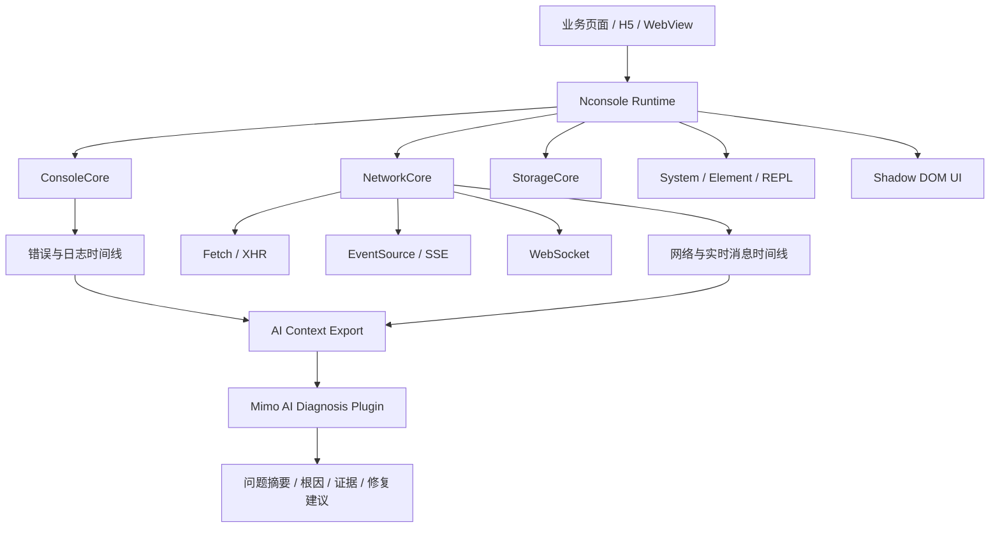
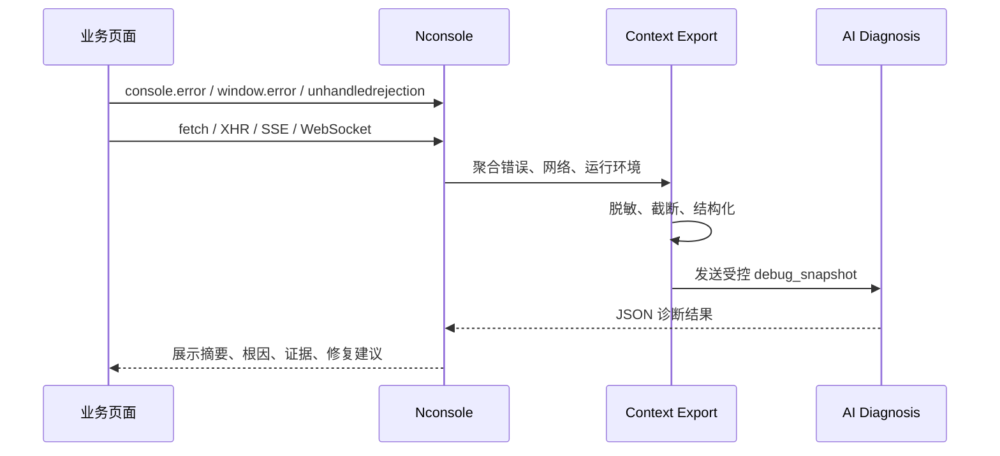

# Nconsole AI-SSE 技术方案

文档用途：研发技术创新大赛提交材料  
参赛形式：自由命题，1 人独立参赛  
项目名称：Nconsole  
当前版本：1.0.7  
生成日期：2026-07-22

## 0. 评委速读摘要

本作品要解决的问题是：传统移动端前端调试工具对 SSE / EventSource 流式请求缺少一等可观测能力，导致 AI 对话、流式生成、实时通知等场景中的“连接中断、消息丢失、格式异常、错误难复现”问题定位效率低。

这个问题值得解决，是因为 SSE 已经成为 AI 应用前端的常见通信方式，但移动 H5、WebView 和真机调试环境无法像桌面浏览器 DevTools 那样稳定、完整地观察流式消息。研发人员需要一个可以嵌入页面、直接查看 SSE 消息流，并能把异常现场整理给 AI 辅助分析的轻量工具。

方案创新点是：Nconsole 不只是复刻 vConsole，而是把 `EventSource / SSE` 作为 Network 面板的一等对象，记录连接状态、命名事件、消息时间线和错误中断；同时聚合 Console、Network、运行环境和脱敏 DOM 摘要，形成可审计的 AI 诊断上下文，由 AI 输出带证据的根因判断和修复建议。

可行性证明方式是：通过 Demo 演示 `/sse/ai` 流式接口监测、SSE 异常定位、AI 上下文导出和敏感信息脱敏；通过 DevOps 平台留存需求、设计、代码提交、构建、测试、截图和 AI 协作记录，证明方案从痛点、实现到验证均可闭环。

| 评委关心的问题 | 本方案回答 |
| --- | --- |
| 要解决什么问题 | vConsole 等移动端调试工具对 SSE 流式请求观测不足，AI 流式应用异常难定位 |
| 为什么值得解决 | SSE 已成为 AI 对话、实时通知、任务进度推送的常见链路，移动端排障成本高 |
| 有什么创新 | SSE 一等可观测 + 多源异常上下文聚合 + 安全脱敏 + AI 结构化诊断 |
| 如何证明可行 | 真实 Demo、验收指标、构建测试记录、DevOps 证据链、AI 协作记录 |

## 1. 命题名称

**Nconsole AI-SSE：面向 AI 流式应用的前端实时通信调试与智能诊断控制台**

备选名称：

- **从 SSE 调试盲区到 AI 诊断：新一代前端调试控制台**
- **Nconsole Sentinel：面向 SSE 异常监测的前端智能诊断工具**
- **AI 流式应用前端调试控制台：SSE 监测与异常根因定位**

## 2. 创意来源与问题背景

本项目最初来源于一个明确的前端排障痛点：移动 H5 场景中常用的 vConsole 可以辅助查看控制台日志和普通网络请求，但在实际调试 AI 对话、流式文本生成、实时通知等场景时，SSE / EventSource 请求缺少直观的可观测能力。vConsole 当前教程中 Network 面板列出的请求类型主要是 `XMLHttpRequest | fetch | sendBeacon`，未将 `EventSource / SSE` 作为明确的一等调试对象。

与此同时，SSE 已经成为 AI 应用前端的重要通信方式。腾讯云文档说明 HTTP SSE 是客户端发起请求后由服务端持续推送流式数据的单向通道；云函数 SSE 文档也指出 SSE 是服务端到浏览器的单向流式消息推送协议，在 AI 生成对话等场景较常见。因此，前端研发在排查“连接建立但无消息”“消息格式异常”“流式输出中断”“接口错误没有显性页面报错”“移动端无法打开浏览器 DevTools”等问题时，需要一个轻量、嵌入式、面向 SSE 的实时调试工具。

Nconsole 的创新切入点是：不是简单复刻传统移动端控制台，而是围绕 AI 流式应用的真实调试缺口，构建一个能监测 SSE、聚合异常上下文，并通过 AI 辅助定位问题的前端诊断控制台。

## 3. 建设目标

| 目标 | 说明 |
| --- | --- |
| 补齐 SSE 可观测能力 | 捕获 `EventSource` 连接生命周期、命名事件、消息内容、错误状态和消息时间线 |
| 提升移动端调试效率 | 在真实手机、H5、内嵌 WebView 中直接查看 Console、Network、Storage、System 等信息 |
| 支持 AI 流式应用排障 | 针对 SSE、WebSocket、Fetch 流式响应和 AI token 输出做实时展示与容量控制 |
| 提供 AI 辅助诊断 | 聚合错误、网络、运行环境和业务上下文，生成问题摘要、可能根因和修复建议 |
| 保留开发证据链 | 使用公司 DevOps 平台沉淀需求、设计、代码、构建、测试和 AI 协作记录 |

## 4. 总体方案

Nconsole 采用“运行时采集核心 + Shadow DOM 调试面板 + 插件化扩展 + AI 诊断”的架构。核心库以 TypeScript 实现，运行时不依赖 UI 框架，支持 ES Module 和 UMD 双格式构建。

## 5. 核心功能设计

### 5.1 Console 与全局异常采集

ConsoleCore 负责接管 `console.log/info/warn/error/debug`，保留原生控制台输出，同时维护 Nconsole 内部日志列表。当前实现已支持：

- 捕获不同级别日志并记录时间、参数快照、来源和栈信息。
- 捕获 `window.error` 和 `unhandledrejection`，将未处理运行时异常纳入统一错误流。
- 对 AI 流式日志按 `streamId` 原地追加，避免每个 token 形成独立日志项。
- 通过 `requestAnimationFrame` 合并高频流式更新，降低 UI 频繁重排风险。
- 控制最大日志数量，避免长时间运行页面内存无限增长。

### 5.2 Network 与实时通信采集

NetworkCore 是本项目的技术重点。它统一接管 `fetch`、`XMLHttpRequest`、`EventSource` 和 `WebSocket`，将普通 HTTP 请求与实时通信连接纳入同一 Network 面板。

当前实现已支持：

- `fetch`：记录 URL、方法、请求头、请求体摘要、状态、耗时、响应头；响应体预览默认关闭，避免干扰业务侧流消费。
- `XMLHttpRequest`：代理 `open/send/setRequestHeader`，在 `loadend/error` 后记录状态、响应头和安全响应摘要。
- `EventSource / SSE`：代理构造函数和事件监听，记录 open、message、error、命名事件、`lastEventId`、消息体、时间戳和消息大小。
- `WebSocket`：代理构造函数和 `send` 方法，记录连接状态、入站消息、出站消息和关闭状态。
- 流式消息容量控制：单个实时通道最多保留 1000 条消息，超限后裁剪旧消息。
- 流式 UI 更新合并：使用 RAF 或短定时器合并消息刷新，避免高频消息造成页面卡顿。

### 5.3 SSE 调试专项设计

SSE 场景的关键难点在于：连接生命周期长、响应体持续流动、消息以事件形式分发，并且原生 EventSource 不像 fetch 一样暴露完整 response 读取控制。Nconsole 的专项设计如下：

| 采集对象 | 设计方案 |
| --- | --- |
| 连接建立 | 代理 `new EventSource(url, init)` 并生成 `NetworkEntry` |
| 连接状态 | 监听 `open/error`，记录 pending、duration、statusText 和错误状态 |
| 普通消息 | 使用原始 `addEventListener('message')` 捕获 message 数据 |
| 命名事件 | 包装业务侧 `addEventListener(type, listener)`，在不改变业务回调的前提下记录事件类型和数据 |
| 取消监听 | 同步包装 `removeEventListener`，避免业务解除监听失效 |
| 消息展示 | 在 Network 详情中展示 Messages 时间线，保留最近 100 条可见消息 |
| 内存控制 | 对 `sseEvents` 和 `messages` 设置上限，避免长连接无限增长 |

该设计保证调试工具只旁路观察，不阻断真实业务请求，不改变业务监听器的执行顺序和参数。

### 5.4 AI 诊断与上下文导出

项目当前已具备两种 AI 辅助能力：

1. **Copy for AI / exportForAI**
   - 从错误日志、关联网络请求和 DOM 摘要中生成 Markdown。
   - 对敏感字段、URL 查询参数、表单值、Cookie、Token、邮箱、手机号等进行脱敏。
   - 限制错误数、关联网络数、正文长度、DOM 快照长度，避免导出不可控上下文。

2. **小米 AI 诊断插件**
   - 默认关闭，仅在 `mimoDiagnosis.enabled` 为 true 时注册。
   - 新增“AI 诊断”标签页。
   - API Key 只保留在当前输入框，不写入配置、Storage 或日志。
   - 诊断请求固定调用 `https://ai-api.libsou.com/v1/chat/completions` 和 `deepseek-v4-flash`。
   - 发送内容为脱敏、限长后的错误、近期日志、网络状态、运行环境和业务补充上下文。
   - 使用 `networkCore.addFetchIgnoreRule` 排除诊断请求本身，避免 API Key 和诊断快照被 Network 面板反向记录。
   - 要求模型只返回结构化 JSON，并在客户端验证字段后再渲染。

诊断结果结构包括：

- 问题摘要。
- 可能根因和置信度。
- 具体证据。
- 建议修复步骤。
- 仍需补充的信息。

## 6. 技术亮点

| 技术点 | 说明 |
| --- | --- |
| SSE 一等可观测 | 不只显示请求 URL，而是展示 SSE 连接状态、命名事件、消息时间线和错误中断 |
| 多源异常上下文聚合 | 将 Console、Network、Runtime、DOM 摘要和业务上下文统一为 AI 可消费快照 |
| 安全脱敏优先 | 对 Header、URL、Body、DOM、日志参数和业务上下文做敏感字段过滤与长度限制 |
| 插件化 AI 能力 | AI 诊断作为可选插件启用，避免默认增加外部请求和安全风险 |
| Shadow DOM 隔离 | 调试面板样式与业务页面隔离，减少 CSS 冲突 |
| 轻量化实现 | 纯 TypeScript，无运行时 UI 框架依赖，适合移动端和嵌入式调试 |
| 高频流式渲染优化 | 对 AI token、SSE message、WebSocket message 使用合并刷新和容量上限 |
| 可恢复全局代理 | destroy 时恢复 console、fetch、XHR、EventSource、WebSocket 等原生实现 |

## 7. AI 工具使用规划

比赛强调 AI 工具独立应用能力。本项目将从“AI 辅助研发”和“AI 作为产品能力”两层展示。

### 7.1 AI 辅助研发

| 阶段 | AI 使用方式 | 证据 |
| --- | --- | --- |
| 需求分析 | 与 AI 讨论 vConsole SSE 调试缺口、比赛命题、MVP 范围 | AI 协作记录、需求文档 |
| 架构设计 | 让 AI 辅助拆解 Console、Network、SSE、AI Diagnosis、脱敏模块 | 技术方案、设计评审记录 |
| 编码实现 | 使用 AI 辅助实现代理逻辑、类型定义、UI 面板、安全处理 | DevOps commit、代码 diff |
| 测试验证 | 使用 AI 辅助设计 SSE/WebSocket/Fetch/异常诊断测试用例 | 测试用例、流水线记录 |
| 文档沉淀 | 使用 AI 生成 README、比赛方案、答辩材料初稿，再人工审校 | 文档提交记录 |

### 7.2 AI 作为产品能力

AI 诊断模块不是简单调用大模型，而是围绕前端异常定位构建受控上下文：

## 8. 安全与合规设计

| 风险 | 处理方式 |
| --- | --- |
| API Key 泄露 | Key 只存在输入框；诊断请求不进入 Network 面板；不持久化 |
| 敏感业务数据外发 | 默认不发送请求头、Cookie、Storage、完整请求体和完整响应体 |
| Prompt Injection | 系统提示明确把日志、DOM、业务字段视为不可信数据；模型输出只接受 JSON |
| 上下文过大 | 对错误、网络、DOM、字符串、数组、对象深度设置容量预算 |
| 全局代理影响业务 | 代理只观察并转发原始调用，destroy 时恢复原生实现 |
| 生产误用 | AI 诊断默认关闭；README 明确仅适用于开发调试 |

## 9. DevOps 证据链规划

比赛要求使用公司 DevOps 平台留存开发证据链。本项目计划沉淀以下材料：

| 证据类型 | 留存内容 |
| --- | --- |
| 需求记录 | 自由命题说明、痛点背景、MVP 范围、验收标准 |
| 设计记录 | 本技术方案、架构图、模块边界、风险评估 |
| 开发记录 | 分支、commit、代码评审、关键 diff |
| 构建记录 | `npm run typecheck`、`npm run build`、产物大小 |
| 测试记录 | SSE 测试页、WebSocket 测试、异常诊断测试、手工验证截图 |
| AI 协作记录 | 需求讨论、方案设计、代码生成、问题排查和文档生成的完整对话导出 |
| 缺陷记录 | 测试中发现的问题、修复提交、复测结果 |
| 发布记录 | npm 包产物、demo 页面、最终答辩材料 |

建议 DevOps 任务拆分：

1. SSE / EventSource 采集能力增强。
2. Network 消息流面板优化。
3. 全局异常捕获与 AI 上下文导出。
4. 小米 AI 诊断插件。
5. 脱敏与安全边界验证。
6. 比赛材料和演示 Demo。

## 10. 演示场景设计

### 场景一：vConsole 难以观察 SSE 流式消息

演示目标：展示传统工具对 SSE 消息流的可视化不足，突出项目切入点。

步骤：

1. 打开移动端 H5 Demo。
2. 发起 `/sse/ai` 流式接口。
3. 展示 Nconsole Network 面板中 SSE 连接和实时 Messages。
4. 展示命名事件、消息数量、连接状态和错误状态。

### 场景二：AI 对话流中断定位

演示目标：展示 SSE + Console + Network 的联合排障。

步骤：

1. 模拟 SSE 中途异常或服务端返回错误事件。
2. Console 捕获错误日志。
3. Network 面板显示对应 SSE 连接错误。
4. 点击 Copy for AI 或 AI 诊断。
5. 展示 AI 给出的摘要、根因证据和修复建议。

### 场景三：安全脱敏

演示目标：证明 AI 诊断不是直接外发全量页面数据。

步骤：

1. 构造包含 token、手机号、邮箱、查询参数的日志和 DOM。
2. 触发 `exportForAI()`。
3. 展示导出的 Markdown 中敏感数据已被 `[REDACTED]` 替换。
4. 展示诊断请求不出现在 Network 面板中。

## 11. 阶段计划

| 阶段 | 时间 | 产出 |
| --- | --- | --- |
| P1：方案收敛 | 第 1 天 | 命题说明、技术方案、MVP 范围 |
| P2：SSE 能力验证 | 第 2-3 天 | EventSource 采集、消息流展示、Demo |
| P3：AI 上下文导出 | 第 4 天 | `exportForAI`、脱敏、Copy for AI |
| P4：AI 诊断插件 | 第 5-6 天 | AI 诊断 Tab、结构化结果、安全边界 |
| P5：验证与材料 | 第 7 天 | 构建记录、测试记录、演示脚本、答辩材料 |

## 12. 验收指标

| 指标 | 验收方式 |
| --- | --- |
| SSE 连接可见 | Network 面板出现 `type=sse` 的请求记录 |
| SSE 消息可见 | 能展示普通 message 和命名事件，消息按时间排序 |
| SSE 错误可见 | `error` 事件能标记请求结束和错误原因 |
| Console 异常可见 | `console.error`、`window.error`、`unhandledrejection` 均进入错误列表 |
| AI 上下文可导出 | `exportForAI()` 生成 Markdown，包含错误、关联请求和运行环境 |
| 敏感信息已脱敏 | Token、Cookie、API Key、邮箱、手机号、URL query 不明文外发 |
| AI 结果结构化 | 诊断结果包含 summary、rootCauses、suggestedFixes、needMoreContext |
| 诊断请求不污染面板 | 小米 AI 请求不会被 Network 面板记录 |
| 构建通过 | `npm run typecheck` 和 `npm run build` 成功 |

## 13. 风险与应对

| 风险 | 说明 | 应对 |
| --- | --- | --- |
| 原生 EventSource 能力有限 | 无法像 fetch 一样完整读取响应头和响应体控制权 | 以事件、状态、消息时间线作为观测核心，明确边界 |
| 长连接消息量过大 | SSE / WebSocket 可能持续产生大量消息 | 设置消息上限和 RAF 合并刷新 |
| AI 诊断误判 | 模型可能根据不足上下文给出错误建议 | 强制输出证据和置信度；证据不足时要求返回需补充信息 |
| 直接浏览器调用 AI 服务受 CORS 限制 | 浏览器直连外部模型服务可能被跨域策略阻止 | 比赛 Demo 使用允许跨域的调试环境；后续可改为服务端代理 |
| 安全审查关注 Key 和隐私 | 浏览器侧输入 Key 本质上仍暴露给页面环境 | 明确仅开发调试使用；Key 不持久化；默认关闭 |
| 与业务或其他调试工具冲突 | 全局代理可能与其他 SDK 叠加 | 单例控制、destroy 恢复、增加测试覆盖 |

## 14. 创新性总结

Nconsole AI-SSE 的创新点不在于“又做一个移动端控制台”，而在于把工具能力聚焦到 AI 流式应用时代真实存在的调试缺口：

1. 以 SSE / EventSource 为核心突破点，解决移动端无法清晰观察流式消息的问题。
2. 将 Console、Network、Runtime、DOM 和业务上下文组合成可审计的异常现场。
3. 把 AI 用在定位链路中，而不是简单问答：先结构化、脱敏、限长，再让模型给出有证据的根因建议。
4. 通过插件化和默认关闭策略，使 AI 诊断能力可控、可扩展、可审查。
5. 通过 DevOps 和 AI 协作记录留存，完整体现个人独立使用 AI 工具完成需求分析、设计、实现、验证和文档交付的能力。

## 15. 参考资料

- vConsole 使用教程：Network 面板列出 `XMLHttpRequest | fetch | sendBeacon` 请求。  
  https://gitee.com/Tencent/vConsole/blob/dev/doc/tutorial_CN.md
- 腾讯云智能体开发平台 HTTP SSE 文档：HTTP SSE 是客户端发起请求后服务端持续推送流式数据的单向通道。  
  https://cloud.tencent.cn/document/product/1759/105561
- 腾讯云云函数 SSE 协议支持：SSE 是服务端到浏览器的单向流式消息推送协议，在 AI 生成对话等场景较常见。  
  https://cloud.tencent.com/document/product/583/90617
